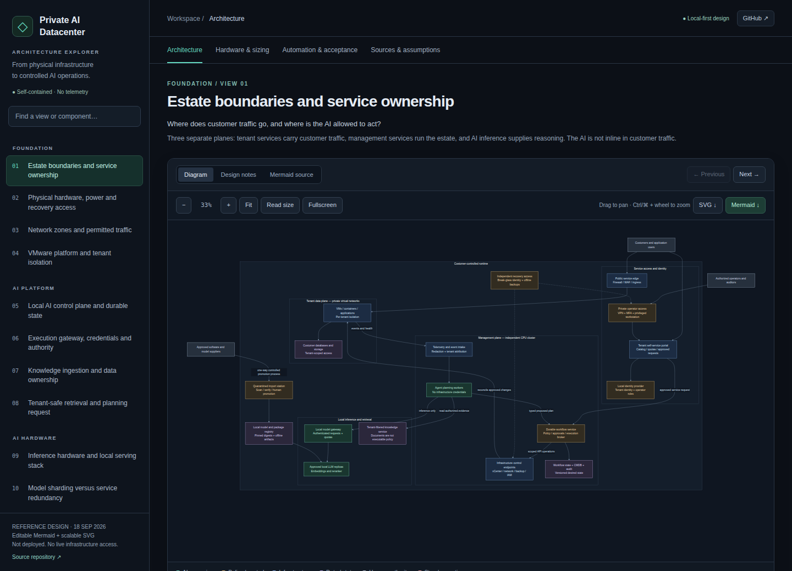

# Private AI Datacenter

A local-first architecture explorer for a VMware datacenter operated through controlled, on-premises AI workflows. **18 separate Mermaid views**, a simple dark interface, and editable source throughout.

## Open the architecture

### [Live GitHub Pages explorer →](https://raal1600.github.io/private-ai-datacenter/)

[Engineering notes](docs/architecture.md) · [Mermaid sources](diagrams/) · [SVG diagrams](svg/) · [Build and deployment](https://github.com/raal1600/private-ai-datacenter/actions/workflows/pages.yml)



The viewer includes grouped navigation and search, dark diagram canvases, zoom and pan, fullscreen, design notes, Mermaid source, SVG/Mermaid exports, a hardware memory worksheet, and an automation acceptance catalog. On smaller screens, navigation collapses into a menu. Press `/` to search or use the arrow keys to move between views.

This is plain HTML, CSS, and JavaScript. **No frontend framework, account, backend, analytics, external font, runtime CDN, or remote diagram renderer.** Source-reference links contact their websites only when clicked. GitHub Pages hosts public documentation; it is not part of the private datacenter's runtime.

## The 18 views

| View | Subject |
|---|---|
| 01 | Estate boundaries and service ownership |
| 02 | Physical hardware, power, and recovery access |
| 03 | Network zones and permitted traffic |
| 04 | VMware platform and tenant isolation |
| 05 | Local AI control plane and durable state |
| 06 | Execution gateway, credentials, and authority |
| 07 | Knowledge ingestion and data ownership |
| 08 | Tenant-safe retrieval and planning |
| 09 | Inference hardware and local serving |
| 10 | Model sharding versus service redundancy |
| 11 | Tenant onboarding and application deployment |
| 12 | Security incident response and bounded containment |
| 13 | ESXi host patching |
| 14 | Backups, restore verification, and disaster recovery |
| 15 | Workflow lifecycle and failure semantics |
| 16 | Model, workflow, and policy supply chain |
| 17 | AI outages, degraded operation, and break-glass |
| 18 | Tenant offboarding and verified deletion |

## Open locally

Download `index.html` or `architecture.html` and open it in a browser. Both files are self-contained and identical; no installation or network connection is needed to explore the diagrams.

The site also provides an [offline ZIP](https://raal1600.github.io/private-ai-datacenter/private-ai-datacenter-offline.zip) with the viewer, diagrams, SVGs, and documentation.

For a local HTTP preview:

```sh
python3 -m http.server 8080 --bind 127.0.0.1
```

Then open `http://127.0.0.1:8080/`.

## Edit and build

```text
src/                     HTML template, base CSS, dark CSS, viewer JavaScript
content/architecture.json Titles, notes, references, hardware, workflow catalog
diagrams/*.mmd            The 18 canonical, editable Mermaid diagrams
svg/                     Rendered diagrams and source-hash manifest
scripts/                 Diagram rendering and offline site assembly
tests/                   Structural and browser regression checks
docs/                    Engineering notes, previews, validation reports
index.html               Generated self-contained entrypoint
architecture.html        Identical compatibility/offline entrypoint
.github/workflows/       Validation and GitHub Pages publication
```

For styling or explanatory-text changes, edit `src/` or `content/`, then:

```sh
python3 scripts/build.py
python3 tests/validate.py
```

For diagram changes, edit the `.mmd` source and regenerate:

```sh
npm ci
npm run render
npm run build
npm test
```

Mermaid is a **build-time dependency only**. Versions are pinned in `package.json` and the lockfile. The build verifies that SVGs match their Mermaid source hashes and rejects stale diagram renders. Do not edit the generated HTML directly; the next build replaces it.

### Browser regression checks

```sh
python3 -m pip install playwright==1.58.0
python3 -m playwright install chromium
python3 tests/browser.py
```

Set `CHROMIUM_EXECUTABLE` to use an existing Chromium binary. Tests cover all views, notes, source tabs, exports, navigation, responsive layout, keyboard focus, calculator validation, JavaScript errors, and runtime network requests. Reports and previews are written to `docs/`.

## Deployment

**Build and deploy architecture** runs on pushes to `main` and can also be started manually. It renders diagrams, builds and validates the viewer, refreshes generated files in the repository, uploads the `_site/` artifact, and deploys it with GitHub's Pages actions. **Validate architecture changes** checks pull requests without publishing or writing to the repository.

GitHub Pages must be enabled with **Settings → Pages → Source: GitHub Actions**. The Pages environment and workflow run show the deployment status. The build uses the repository's short-lived Actions token; no personal access token is stored here.

## Scope and data protection

This is a **reference design**, not a deployed control plane, security product, hardware purchase order, or certification. The viewer cannot administer infrastructure. It contains no customer data, credentials, or live infrastructure connections. Never add those to this public repository.

Local processing supports the ownership requirement but is not proof of GDPR compliance. Hardware figures and model examples remain documented assumptions that require validation against the exact checkpoint, runtime, concurrency, failure capacity, facilities, and vendor support. Primary references are linked in each view.
