# Private AI Datacenter — detailed architecture

[Open the explorer](https://raal1600.github.io/private-ai-datacenter/)

Reference design, not deployed infrastructure.

## 01 · Estate boundaries and service ownership

Where does customer traffic go, and where is the AI allowed to act?

Three separate planes: tenant services carry customer traffic, management services run the estate, and AI inference supplies reasoning. The AI is not inline in customer traffic.

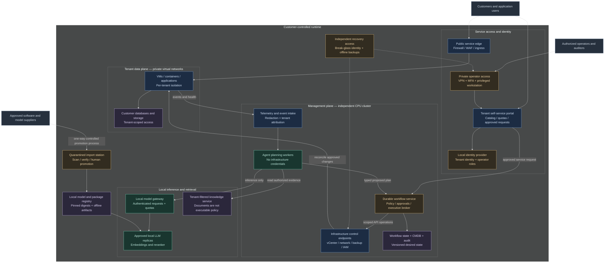
```mermaid
---
config:
  theme: dark
---
flowchart TB
    USERS["Customers and application users"]:::human
    OPS["Authorized operators and auditors"]:::human
    EXT["Approved software and model suppliers"]:::human
    subgraph PRIVATE["Customer-controlled runtime"]
      subgraph EDGE["Service access and identity"]
        WAF["Public service edge<br/>Firewall / WAF / ingress"]:::infrastructure
        ACCESS["Private operator access<br/>VPN + MFA + privileged workstation"]:::control
        PORTAL["Tenant self-service portal<br/>Catalog / quotas / approved requests"]:::infrastructure
        IAM["Local identity provider<br/>Tenant identity + operator roles"]:::control
      end
      subgraph TENANT["Tenant data plane — private virtual networks"]
        WORK["VMs / containers / applications<br/>Per-tenant isolation"]:::infrastructure
        DATA["Customer databases and storage<br/>Tenant-scoped access"]:::store
      end
      subgraph MGMT["Management plane — independent CPU cluster"]
        EVENT["Telemetry and event intake<br/>Redaction + tenant attribution"]:::infrastructure
        PLAN["Agent planning workers<br/>No infrastructure credentials"]:::ai
        WF["Durable workflow service<br/>Policy / approvals / execution broker"]:::control
        API["Infrastructure control endpoints<br/>vCenter / network / backup / IAM"]:::infrastructure
        STATE["Workflow state + CMDB + audit<br/>Versioned desired state"]:::store
      end
      subgraph AI["Local inference and retrieval"]
        GATE["Local model gateway<br/>Authenticated requests + quotas"]:::ai
        MODELS["Approved local LLM replicas<br/>Embeddings and reranker"]:::ai
        KNOW["Tenant-filtered knowledge service<br/>Documents are not executable policy"]:::store
      end
      IMPORT["Quarantined import station<br/>Scan / verify / human promotion"]:::control
      MIRROR["Local model and package registry<br/>Pinned digests + offline artifacts"]:::store
      RECOVERY["Independent recovery access<br/>Break-glass identity + offline backups"]:::control
    end
    USERS --> WAF --> WORK --> DATA
    USERS --> PORTAL
    OPS --> ACCESS --> PORTAL
    PORTAL --> IAM
    PORTAL -->|approved service request| WF
    WORK -->|events and health| EVENT --> PLAN
    PLAN -->|read authorized evidence| KNOW
    PLAN -->|inference only| GATE --> MODELS
    PLAN -->|typed proposed plan| WF
    WF -->|scoped API operations| API
    API -->|reconcile approved changes| WORK
    WF --> STATE
    EXT -->|one-way controlled promotion process| IMPORT --> MIRROR
    MIRROR --> MODELS
    RECOVERY -.-> ACCESS
    RECOVERY -.-> API

classDef ai fill:#19362f,stroke:#63ab96,color:#bde7dc,stroke-width:1.5px;
classDef control fill:#322c20,stroke:#b39766,color:#ebd1a5,stroke-width:1.5px;
classDef infrastructure fill:#1c2c43,stroke:#6d91bd,color:#d0e0f5,stroke-width:1.3px;
classDef store fill:#2b273b,stroke:#a191c0,color:#dbd1f1,stroke-width:1.3px;
classDef human fill:#26303d,stroke:#91a1b6,color:#d1dae5,stroke-width:1.3px;
classDef stop fill:#3b252c,stroke:#c18790,color:#efc2c7,stroke-width:1.5px;
```

### Engineering notes

- This is a proposed deployment pattern, not an inventory discovered from your datacenter. Later views expand each boundary rather than putting every component here.
- Customer data remains in the on-prem runtime, including prompts, tool results, embeddings, traces, workflow state and backups. Separate off-site recovery may use another customer-controlled location.
- The application data plane must keep serving when the agent or GPU pool is unavailable. Existing HA, firewall enforcement, backup schedules and safety controllers do not depend on LLM decisions.
- Local hosting is a design requirement, not proof of GDPR compliance. Legal basis, data minimization, retention, processor arrangements, security and any transfers still require assessment.

### References

- [EUR-Lex — General Data Protection Regulation](https://eur-lex.europa.eu/eli/reg/2016/679/oj/eng)
- [Broadcom — vSphere Automation API](https://developer.broadcom.com/xapis/vsphere-automation-api/latest/)

## 02 · Physical hardware, power and recovery access

What equipment exists physically, and how do we recover when the ordinary network fails?

Production uses separate management CPU nodes, VMware compute, storage and inference hardware. The operator PC is a client, never the always-on management server.

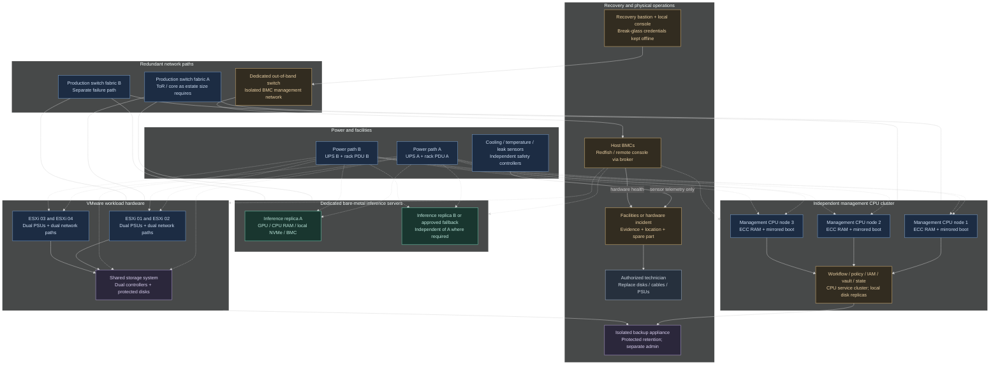
```mermaid
---
config:
  theme: dark
---
flowchart TB
    subgraph POWER["Power and facilities"]
      PA["Power path A<br/>UPS A + rack PDU A"]:::infrastructure
      PB["Power path B<br/>UPS B + rack PDU B"]:::infrastructure
      COOL["Cooling / temperature / leak sensors<br/>Independent safety controllers"]:::infrastructure
    end
    subgraph FABRIC["Redundant network paths"]
      NA["Production switch fabric A<br/>ToR / core as estate size requires"]:::infrastructure
      NB["Production switch fabric B<br/>Separate failure path"]:::infrastructure
      OOB["Dedicated out-of-band switch<br/>Isolated BMC management network"]:::control
    end
    subgraph CPU["Independent management CPU cluster"]
      M1["Management CPU node 1<br/>ECC RAM + mirrored boot"]:::infrastructure
      M2["Management CPU node 2<br/>ECC RAM + mirrored boot"]:::infrastructure
      M3["Management CPU node 3<br/>ECC RAM + mirrored boot"]:::infrastructure
      CP["Workflow / policy / IAM / vault / state<br/>CPU service cluster; local disk replicas"]:::control
    end
    subgraph VM["VMware workload hardware"]
      E12["ESXi 01 and ESXi 02<br/>Dual PSUs + dual network paths"]:::infrastructure
      E34["ESXi 03 and ESXi 04<br/>Dual PSUs + dual network paths"]:::infrastructure
      SAN["Shared storage system<br/>Dual controllers + protected disks"]:::store
    end
    subgraph GPU["Dedicated bare-metal inference servers"]
      GA["Inference replica A<br/>GPU / CPU RAM / local NVMe / BMC"]:::ai
      GB["Inference replica B or approved fallback<br/>Independent of A where required"]:::ai
    end
    subgraph REC["Recovery and physical operations"]
      JUMP["Recovery bastion + local console<br/>Break-glass credentials kept offline"]:::control
      BMC["Host BMCs<br/>Redfish / remote console via broker"]:::control
      BACK["Isolated backup appliance<br/>Protected retention; separate admin"]:::store
      TECH["Authorized technician<br/>Replace disks / cables / PSUs"]:::human
      TICKET["Facilities or hardware incident<br/>Evidence + location + spare part"]:::control
    end
    PA -.-> M1 & M2 & M3 & E12 & E34 & SAN & GA & GB
    PB -.-> M1 & M2 & M3 & E12 & E34 & SAN & GA & GB
    NA --- CPU & VM & GPU
    NB --- CPU & VM & GPU
    M1 & M2 & M3 --> CP
    E12 & E34 --> SAN
    JUMP --> OOB --> BMC
    BMC -.-> CPU & VM & GPU
    VM --> BACK
    CP --> BACK
    COOL -->|sensor telemetry only| TICKET
    BMC -->|hardware health| TICKET --> TECH

classDef ai fill:#19362f,stroke:#63ab96,color:#bde7dc,stroke-width:1.5px;
classDef control fill:#322c20,stroke:#b39766,color:#ebd1a5,stroke-width:1.5px;
classDef infrastructure fill:#1c2c43,stroke:#6d91bd,color:#d0e0f5,stroke-width:1.3px;
classDef store fill:#2b273b,stroke:#a191c0,color:#dbd1f1,stroke-width:1.3px;
classDef human fill:#26303d,stroke:#91a1b6,color:#d1dae5,stroke-width:1.3px;
classDef stop fill:#3b252c,stroke:#c18790,color:#efc2c7,stroke-width:1.5px;
```

### Engineering notes

- Counts illustrate topology, not a purchase order. Three voting management members only tolerate a failure if their placement, storage and quorum configuration support it. Three nodes in one rack do not create rack-level resilience.
- Dual power supplies must connect to genuinely separate supported power paths. Cooling, utility supply and fire suppression need facilities engineering; software agents do not replace their safety controls.
- Use dedicated GPU servers initially rather than making inference depend on the VMware cluster being repaired. GPU virtualization is a separate compatibility and licensing decision.
- Storage shown here is a shared array design. A vSAN design is an alternative with its own controller, disk, network, fault-domain and licensing assessment; do not buy both just because both appear in product brochures.
- AI can diagnose hardware and prepare work orders. Physical replacement, access control, electrical work and emergency decisions remain authorized human responsibilities.

### References

- [DMTF — Redfish standard](https://www.dmtf.org/standards/redfish)

## 03 · Network zones and permitted traffic

Which networks can communicate, over which protocols, and what is denied?

VLAN and subnet numbers are examples. Inter-zone policy is deny-by-default, and inference workers have no route to infrastructure administration or the public internet.

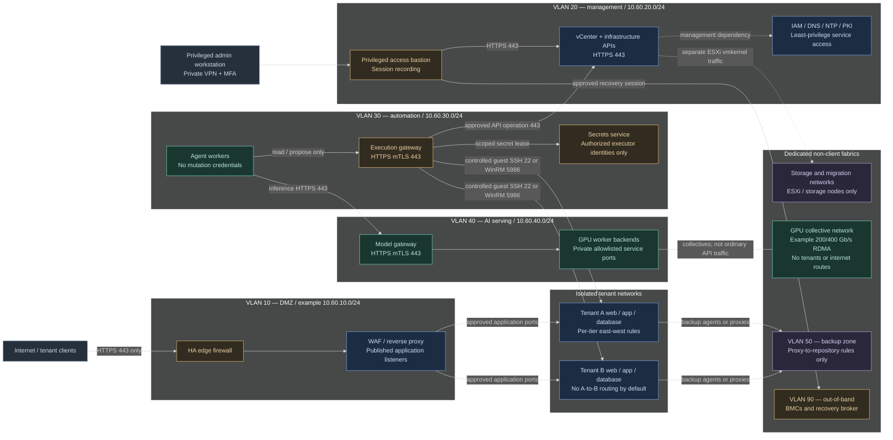
```mermaid
---
config:
  theme: dark
---
flowchart LR
    INTERNET["Internet / tenant clients"]:::human
    ADMIN["Privileged admin workstation<br/>Private VPN + MFA"]:::human
    subgraph DMZ["VLAN 10 — DMZ / example 10.60.10.0/24"]
      FW["HA edge firewall"]:::control
      INGRESS["WAF / reverse proxy<br/>Published application listeners"]:::infrastructure
    end
    subgraph MG["VLAN 20 — management / 10.60.20.0/24"]
      JUMP["Privileged access bastion<br/>Session recording"]:::control
      VCTR["vCenter + infrastructure APIs<br/>HTTPS 443"]:::infrastructure
      CORE["IAM / DNS / NTP / PKI<br/>Least-privilege service access"]:::infrastructure
    end
    subgraph AUTOM["VLAN 30 — automation / 10.60.30.0/24"]
      AGENT["Agent workers<br/>No mutation credentials"]:::ai
      EXEC["Execution gateway<br/>HTTPS mTLS 443"]:::control
      VAULT["Secrets service<br/>Authorized executor identities only"]:::control
    end
    subgraph INFER["VLAN 40 — AI serving / 10.60.40.0/24"]
      LLM["Model gateway<br/>HTTPS mTLS 443"]:::ai
      WORKER["GPU worker backends<br/>Private allowlisted service ports"]:::ai
    end
    subgraph TEN["Isolated tenant networks"]
      TA["Tenant A web / app / database<br/>Per-tier east-west rules"]:::infrastructure
      TB["Tenant B web / app / database<br/>No A-to-B routing by default"]:::infrastructure
    end
    subgraph IO["Dedicated non-client fabrics"]
      STORAGE["Storage and migration networks<br/>ESXi / storage nodes only"]:::store
      RDMA["GPU collective network<br/>Example 200/400 Gb/s RDMA<br/>No tenants or internet routes"]:::ai
      BACKUP["VLAN 50 — backup zone<br/>Proxy-to-repository rules only"]:::store
      OOB["VLAN 90 — out-of-band<br/>BMCs and recovery broker"]:::control
    end
    INTERNET -->|HTTPS 443 only| FW --> INGRESS
    INGRESS -->|approved application ports| TA & TB
    ADMIN --> JUMP
    JUMP -->|HTTPS 443| VCTR
    JUMP -->|approved recovery session| OOB
    AGENT -->|read / propose only| EXEC
    AGENT -->|inference HTTPS 443| LLM --> WORKER
    EXEC -->|approved API operation 443| VCTR
    EXEC -->|scoped secret lease| VAULT
    EXEC -->|controlled guest SSH 22 or WinRM 5986| TA & TB
    VCTR -.->|management dependency| CORE
    WORKER ---|collectives; not ordinary API traffic| RDMA
    TA & TB -->|backup agents or proxies| BACKUP
    VCTR -.->|separate ESXi vmkernel traffic| STORAGE

classDef ai fill:#19362f,stroke:#63ab96,color:#bde7dc,stroke-width:1.5px;
classDef control fill:#322c20,stroke:#b39766,color:#ebd1a5,stroke-width:1.5px;
classDef infrastructure fill:#1c2c43,stroke:#6d91bd,color:#d0e0f5,stroke-width:1.3px;
classDef store fill:#2b273b,stroke:#a191c0,color:#dbd1f1,stroke-width:1.3px;
classDef human fill:#26303d,stroke:#91a1b6,color:#d1dae5,stroke-width:1.3px;
classDef stop fill:#3b252c,stroke:#c18790,color:#efc2c7,stroke-width:1.5px;
```

### Engineering notes

- Logical rules are not a complete vendor firewall export. Populate the exact VMware, backup, storage, identity, DNS/NTP and inference port matrix for the installed versions before implementation.
- Keep storage I/O, vMotion, GPU collectives, tenant application traffic and BMC recovery traffic separate. A VLAN label alone is not authorization or tenant isolation.
- Only the execution gateway may reach mutation APIs. Host SSH is an exception for approved runbooks, not the agent's default root access. Human RDP should be brokered and scoped, never publicly exposed.
- RDMA and distributed-worker transports may not provide application-level encryption. Isolate the fabric and validate supported link encryption and threat controls; do not label every collective connection as TLS.
- Outbound internet from production inference, retrieval and execution workers is denied. Downloads occur through the separate import-and-promotion workflow in view 16.

### References

- [Broadcom — vSphere Automation API](https://developer.broadcom.com/xapis/vsphere-automation-api/latest/)
- [vLLM — parallelism and scaling](https://docs.vllm.ai/en/latest/serving/parallelism_scaling/)

## 04 · VMware platform and tenant isolation

How do physical servers become isolated deployment environments?

vCenter controls lifecycle; ESXi runs workloads. The agent requests scoped VMware API operations through the broker rather than using an administrator desktop session.

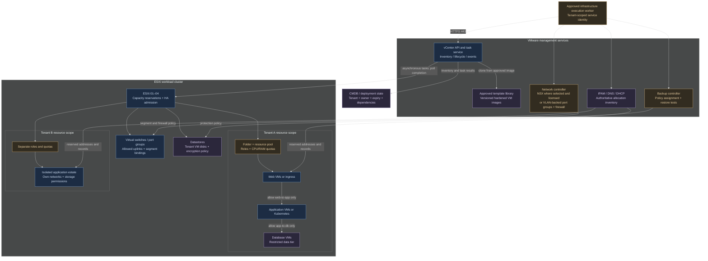
```mermaid
---
config:
  theme: dark
---
flowchart TB
    BROKER["Approved infrastructure execution worker<br/>Tenant-scoped service identity"]:::control
    subgraph CONTROL["VMware management services"]
      VC["vCenter API and task service<br/>Inventory / lifecycle / events"]:::infrastructure
      LIB["Approved template library<br/>Versioned hardened VM images"]:::store
      NET["Network controller<br/>NSX where selected and licensed<br/>or VLAN-backed port groups + firewall"]:::control
      IPAM["IPAM / DNS / DHCP<br/>Authoritative allocation inventory"]:::store
      BACK["Backup controller<br/>Policy assignment + restore tests"]:::control
    end
    subgraph CLUSTER["ESXi workload cluster"]
      HOSTS["ESXi 01–04<br/>Capacity reservations + HA admission"]:::infrastructure
      VSW["Virtual switches / port groups<br/>Allowed uplinks + segment bindings"]:::infrastructure
      STORE["Datastores<br/>Tenant VM disks + encryption policy"]:::store
      subgraph A["Tenant A resource scope"]
        AP["Folder + resource pool<br/>Roles + CPU/RAM quotas"]:::control
        AW["Web VMs or ingress"]:::infrastructure
        AA["Application VMs or Kubernetes"]:::infrastructure
        AD["Database VMs<br/>Restricted data tier"]:::store
      end
      subgraph B["Tenant B resource scope"]
        BP["Separate roles and quotas"]:::control
        BW["Isolated application estate<br/>Own networks + storage permissions"]:::infrastructure
      end
    end
    CMDB["CMDB / deployment state<br/>Tenant + owner + expiry + dependencies"]:::store
    BROKER -->|HTTPS 443| VC
    BROKER --> NET & IPAM & BACK
    VC -->|clone from approved image| LIB
    VC -->|asynchronous tasks; poll completion| HOSTS
    HOSTS --> VSW & STORE
    HOSTS --> AP & BP
    AP --> AW -->|allow web-to-app only| AA -->|allow app-to-db only| AD
    BP --> BW
    NET -->|segment and firewall policy| VSW
    IPAM -->|reserved addresses and records| AW & BW
    BACK -->|protection policy| STORE
    VC -->|inventory and task results| CMDB

classDef ai fill:#19362f,stroke:#63ab96,color:#bde7dc,stroke-width:1.5px;
classDef control fill:#322c20,stroke:#b39766,color:#ebd1a5,stroke-width:1.5px;
classDef infrastructure fill:#1c2c43,stroke:#6d91bd,color:#d0e0f5,stroke-width:1.3px;
classDef store fill:#2b273b,stroke:#a191c0,color:#dbd1f1,stroke-width:1.3px;
classDef human fill:#26303d,stroke:#91a1b6,color:#d1dae5,stroke-width:1.3px;
classDef stop fill:#3b252c,stroke:#c18790,color:#efc2c7,stroke-width:1.5px;
```

### Engineering notes

- A VMware folder or resource pool is an administrative boundary, not sufficient network isolation. Combine roles, segments, firewall rules, storage permissions and tenant-specific service identities.
- Optional NSX functionality is not assumed included in an unspecified VMware installation. Confirm exact platform version, entitlement and integration API before purchase.
- Select CPU and memory reservations and HA admission rules from measured workloads. Four hosts do not by themselves guarantee resilience to a whole-rack loss.
- Infrastructure state is confirmed from authoritative APIs after each task. A successful tool response or a generated statement is not proof that a VM is healthy.
- DNS names identify services; they are not the tenant boundary. Public and private DNS changes are independent steps with their own authorization.

### References

- [Broadcom — vSphere Automation API](https://developer.broadcom.com/xapis/vsphere-automation-api/latest/)

## 05 · Local AI control plane and durable state

What actually runs continuously, beyond the language model?

A local model is one service in a controlled operations platform. Event intake, workflow persistence, reconciliation, policies and verification run on CPU services.

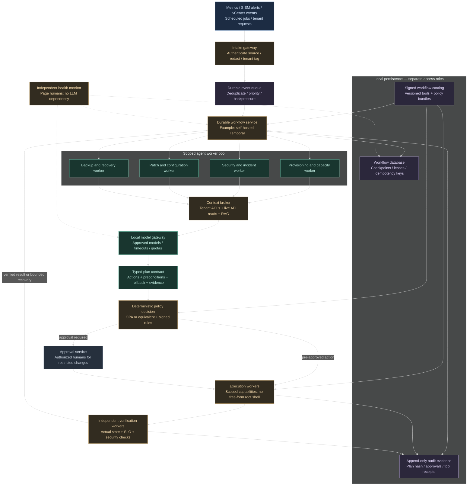
```mermaid
---
config:
  theme: dark
---
flowchart TB
    EVENTS["Metrics / SIEM alerts / vCenter events<br/>Scheduled jobs / tenant requests"]:::infrastructure
    NORMAL["Intake gateway<br/>Authenticate source / redact / tenant tag"]:::control
    QUEUE["Durable event queue<br/>Deduplicate / priority / backpressure"]:::store
    WF["Durable workflow service<br/>Example: self-hosted Temporal"]:::control
    subgraph WORKERS["Scoped agent worker pool"]
      PROV["Provisioning and capacity worker"]:::ai
      SEC["Security and incident worker"]:::ai
      PATCH["Patch and configuration worker"]:::ai
      DR["Backup and recovery worker"]:::ai
    end
    CONTEXT["Context broker<br/>Tenant ACLs + live API reads + RAG"]:::control
    MODEL["Local model gateway<br/>Approved models / timeouts / quotas"]:::ai
    PLAN["Typed plan contract<br/>Actions + preconditions + rollback + evidence"]:::ai
    POLICY["Deterministic policy decision<br/>OPA or equivalent + signed rules"]:::control
    APPROVAL["Approval service<br/>Authorized humans for restricted changes"]:::human
    EXEC["Execution workers<br/>Scoped capabilities; no free-form root shell"]:::control
    VERIFY["Independent verification workers<br/>Actual state + SLO + security checks"]:::control
    subgraph STATE["Local persistence — separate access roles"]
      DB["Workflow database<br/>Checkpoints / leases / idempotency keys"]:::store
      AUDIT["Append-only audit evidence<br/>Plan hash / approvals / tool receipts"]:::store
      CATALOG["Signed workflow catalog<br/>Versioned tools + policy bundles"]:::store
    end
    WATCH["Independent health monitor<br/>Page humans; no LLM dependency"]:::control
    EVENTS --> NORMAL --> QUEUE --> WF
    WF --> PROV & SEC & PATCH & DR
    PROV & SEC & PATCH & DR --> CONTEXT
    CONTEXT --> MODEL
    MODEL --> PLAN --> POLICY
    POLICY -->|pre-approved action| EXEC
    POLICY -->|approval required| APPROVAL --> EXEC
    EXEC --> VERIFY -->|verified result or bounded recovery| WF
    WF <--> DB
    CATALOG --> WF & POLICY & EXEC
    WF --> AUDIT
    EXEC --> AUDIT
    VERIFY --> AUDIT
    WATCH -.-> WF & MODEL & DB

classDef ai fill:#19362f,stroke:#63ab96,color:#bde7dc,stroke-width:1.5px;
classDef control fill:#322c20,stroke:#b39766,color:#ebd1a5,stroke-width:1.5px;
classDef infrastructure fill:#1c2c43,stroke:#6d91bd,color:#d0e0f5,stroke-width:1.3px;
classDef store fill:#2b273b,stroke:#a191c0,color:#dbd1f1,stroke-width:1.3px;
classDef human fill:#26303d,stroke:#91a1b6,color:#d1dae5,stroke-width:1.3px;
classDef stop fill:#3b252c,stroke:#c18790,color:#efc2c7,stroke-width:1.5px;
```

### Engineering notes

- Agent roles are logical capabilities, not necessarily eight separate always-running models. A worker pool can share approved model endpoints while maintaining tenant and task isolation.
- Temporal and OPA are implementation candidates, not a pre-integrated product. The durable engine runs deterministic workflow logic; LLM calls and side effects run as recorded activities.
- Prefer at-least-once delivery with deduplication and idempotent actions. Exactly-once execution across vCenter, DNS, firewalls and backups should not be assumed.
- Keep event history, lease state and approvals outside model memory. A restarted worker resumes from recorded state rather than improvising what happened.
- Observability and safety monitoring continue without inference. An unhealthy AI service reduces automation; it must not disable ordinary monitoring or customer services.

### References

- [Temporal — workflow documentation](https://docs.temporal.io/workflows)
- [Open Policy Agent — official documentation](https://www.openpolicyagent.org/docs)

## 06 · Execution gateway, credentials and authority

How is an AI proposal converted into a safe, auditable infrastructure change?

The authorization boundary is implemented in software outside the model. Every mutation is bound to an exact plan, tenant, target, workflow version and expiry.

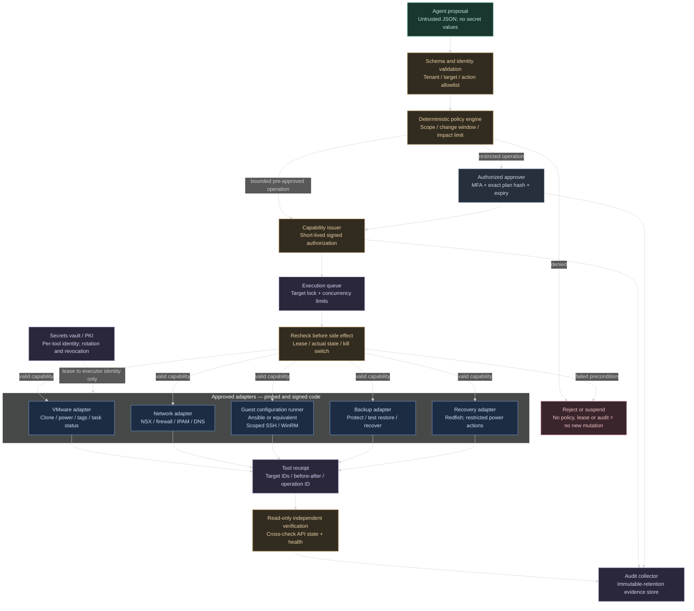
```mermaid
---
config:
  theme: dark
---
flowchart TB
    AI["Agent proposal<br/>Untrusted JSON; no secret values"]:::ai
    VALIDATE["Schema and identity validation<br/>Tenant / target / action allowlist"]:::control
    POLICY["Deterministic policy engine<br/>Scope / change window / impact limit"]:::control
    HUMAN["Authorized approver<br/>MFA + exact plan hash + expiry"]:::human
    CAP["Capability issuer<br/>Short-lived signed authorization"]:::control
    QUEUE["Execution queue<br/>Target lock + concurrency limits"]:::store
    CHECK["Recheck before side effect<br/>Lease / actual state / kill switch"]:::control
    VAULT["Secrets vault / PKI<br/>Per-tool identity; rotation and revocation"]:::store
    subgraph ADAPTERS["Approved adapters — pinned and signed code"]
      VMW["VMware adapter<br/>Clone / power / tags / task status"]:::infrastructure
      NET["Network adapter<br/>NSX / firewall / IPAM / DNS"]:::infrastructure
      OS["Guest configuration runner<br/>Ansible or equivalent<br/>Scoped SSH / WinRM"]:::infrastructure
      BKP["Backup adapter<br/>Protect / test restore / recover"]:::infrastructure
      BMC["Recovery adapter<br/>Redfish; restricted power actions"]:::infrastructure
    end
    RECEIPT["Tool receipt<br/>Target IDs / before-after / operation ID"]:::store
    VERIFY["Read-only independent verification<br/>Cross-check API state + health"]:::control
    AUDIT["Audit collector<br/>Immutable-retention evidence store"]:::store
    STOP["Reject or suspend<br/>No policy, lease or audit = no new mutation"]:::stop
    AI --> VALIDATE --> POLICY
    POLICY -->|bounded pre-approved operation| CAP
    POLICY -->|restricted operation| HUMAN --> CAP
    POLICY -->|denied| STOP
    CAP --> QUEUE --> CHECK
    CHECK -->|valid capability| VMW & NET & OS & BKP & BMC
    CHECK -->|failed precondition| STOP
    VAULT -->|lease to executor identity only| ADAPTERS
    VMW & NET & OS & BKP & BMC --> RECEIPT --> VERIFY --> AUDIT
    CAP --> AUDIT
    HUMAN --> AUDIT

classDef ai fill:#19362f,stroke:#63ab96,color:#bde7dc,stroke-width:1.5px;
classDef control fill:#322c20,stroke:#b39766,color:#ebd1a5,stroke-width:1.5px;
classDef infrastructure fill:#1c2c43,stroke:#6d91bd,color:#d0e0f5,stroke-width:1.3px;
classDef store fill:#2b273b,stroke:#a191c0,color:#dbd1f1,stroke-width:1.3px;
classDef human fill:#26303d,stroke:#91a1b6,color:#d1dae5,stroke-width:1.3px;
classDef stop fill:#3b252c,stroke:#c18790,color:#efc2c7,stroke-width:1.5px;
```

### Engineering notes

- The agent cannot approve its own proposal, read the vault, change the signed policy bundle or edit its execution tool allowlist. Approval is not a prompt instruction.
- Bind approvals to action arguments and plan hash. Any changed target, volume, network rule or parameter invalidates approval and requires re-evaluation.
- Credential leases are short-lived and scoped to the adapter. Broad shared vCenter Administrator or domain-admin credentials are excluded from the default design.
- Destructive recovery, backup retention changes, identity-policy changes and physical power controls use stricter authority. Pre-approved incident containment can be narrow and time-limited.
- MCP may expose the adapter interface, but MCP is not a security boundary by itself. Authentication, authorization, validation, logging and network controls remain mandatory.
- Before mutation, persist the approved action and audit intent. If the audit destination fails after a side effect, retain a local durable receipt, stop further mutations and escalate.

### References

- [Open Policy Agent — official documentation](https://www.openpolicyagent.org/docs)
- [Broadcom — vSphere Automation API](https://developer.broadcom.com/xapis/vsphere-automation-api/latest/)
- [DMTF — Redfish standard](https://www.dmtf.org/standards/redfish)
- [OWASP — LLM prompt injection risk](https://genai.owasp.org/llmrisk/llm01-prompt-injection/)

## 07 · Knowledge ingestion and data ownership

What is indexed locally, and how do source permissions and deletion propagate?

Documents feed retrieval; live metrics and infrastructure state stay in their authoritative stores. Indexing is permission-aware, versioned and reversible.

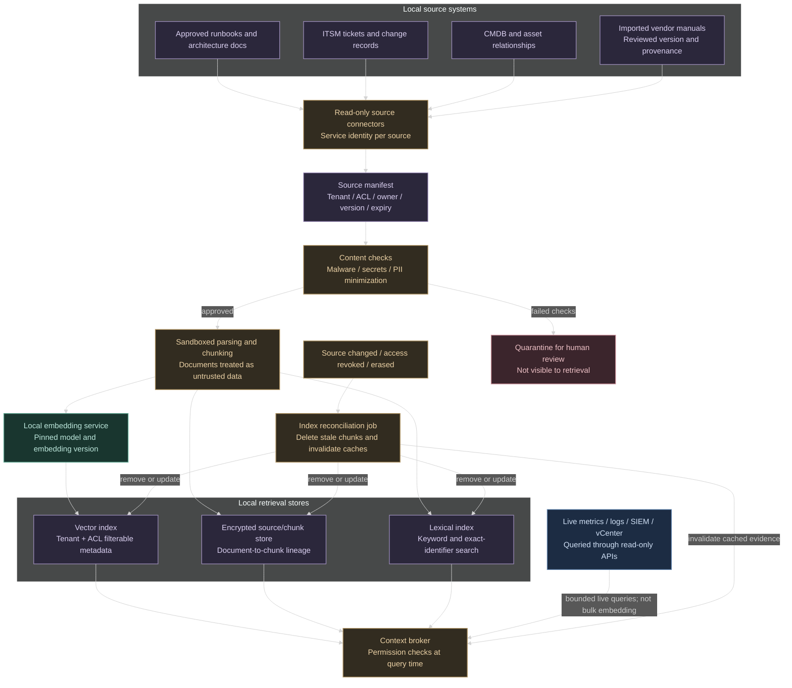
```mermaid
---
config:
  theme: dark
---
flowchart TB
    subgraph SOURCES["Local source systems"]
      DOCS["Approved runbooks and architecture docs"]:::store
      TICKETS["ITSM tickets and change records"]:::store
      INVENTORY["CMDB and asset relationships"]:::store
      MANUAL["Imported vendor manuals<br/>Reviewed version and provenance"]:::store
    end
    READ["Read-only source connectors<br/>Service identity per source"]:::control
    MANIFEST["Source manifest<br/>Tenant / ACL / owner / version / expiry"]:::store
    SCAN["Content checks<br/>Malware / secrets / PII minimization"]:::control
    PARSE["Sandboxed parsing and chunking<br/>Documents treated as untrusted data"]:::control
    EMBED["Local embedding service<br/>Pinned model and embedding version"]:::ai
    subgraph INDEX["Local retrieval stores"]
      OBJ["Encrypted source/chunk store<br/>Document-to-chunk lineage"]:::store
      VECTOR["Vector index<br/>Tenant + ACL filterable metadata"]:::store
      TEXT["Lexical index<br/>Keyword and exact-identifier search"]:::store
    end
    LIVE["Live metrics / logs / SIEM / vCenter<br/>Queried through read-only APIs"]:::infrastructure
    CONTEXT["Context broker<br/>Permission checks at query time"]:::control
    CHANGE["Source changed / access revoked / erased"]:::control
    RECON["Index reconciliation job<br/>Delete stale chunks and invalidate caches"]:::control
    QUAR["Quarantine for human review<br/>Not visible to retrieval"]:::stop
    DOCS & TICKETS & INVENTORY & MANUAL --> READ --> MANIFEST --> SCAN
    SCAN -->|approved| PARSE --> EMBED --> VECTOR
    SCAN -->|failed checks| QUAR
    PARSE --> OBJ & TEXT
    VECTOR & OBJ & TEXT --> CONTEXT
    LIVE -->|bounded live queries; not bulk embedding| CONTEXT
    CHANGE --> RECON
    RECON -->|remove or update| OBJ & VECTOR & TEXT
    RECON -->|invalidate cached evidence| CONTEXT

classDef ai fill:#19362f,stroke:#63ab96,color:#bde7dc,stroke-width:1.5px;
classDef control fill:#322c20,stroke:#b39766,color:#ebd1a5,stroke-width:1.5px;
classDef infrastructure fill:#1c2c43,stroke:#6d91bd,color:#d0e0f5,stroke-width:1.3px;
classDef store fill:#2b273b,stroke:#a191c0,color:#dbd1f1,stroke-width:1.3px;
classDef human fill:#26303d,stroke:#91a1b6,color:#d1dae5,stroke-width:1.3px;
classDef stop fill:#3b252c,stroke:#c18790,color:#efc2c7,stroke-width:1.5px;
```

### Engineering notes

- Assign tenant and ACL metadata before embedding. Retrieval must recheck authorization after candidates are selected and before any text is passed to the model.
- Customer databases are not automatically ingested. Start with operational metadata and approved documentation; obtain explicit authorization and minimize fields for any customer-content use.
- Logs and time series remain in log and metric stores. Query a bounded time range when needed; do not continuously embed every raw log line.
- Embeddings, summaries, cached context, traces and indexed chunks can remain sensitive. Apply retention, encryption, access control and deletion handling to these derived datasets.
- A document may describe a command but cannot grant permission to execute it. Treat retrieved text and tool output as possible prompt-injection input.
- Deletion requires chunk lineage and reconciliation. Do not promise immediate deletion from immutable backups; follow documented retention, legal-hold rules and tombstone replay on restore.

### References

- [EUR-Lex — General Data Protection Regulation](https://eur-lex.europa.eu/eli/reg/2016/679/oj/eng)
- [OWASP — LLM prompt injection risk](https://genai.owasp.org/llmrisk/llm01-prompt-injection/)

## 08 · Tenant-safe retrieval and planning request

What happens between an incident arriving and the model producing a plan?

Caller identity determines the tenant scope. The model cannot choose another tenant, read arbitrary logs or substitute stale documentation for current infrastructure state.

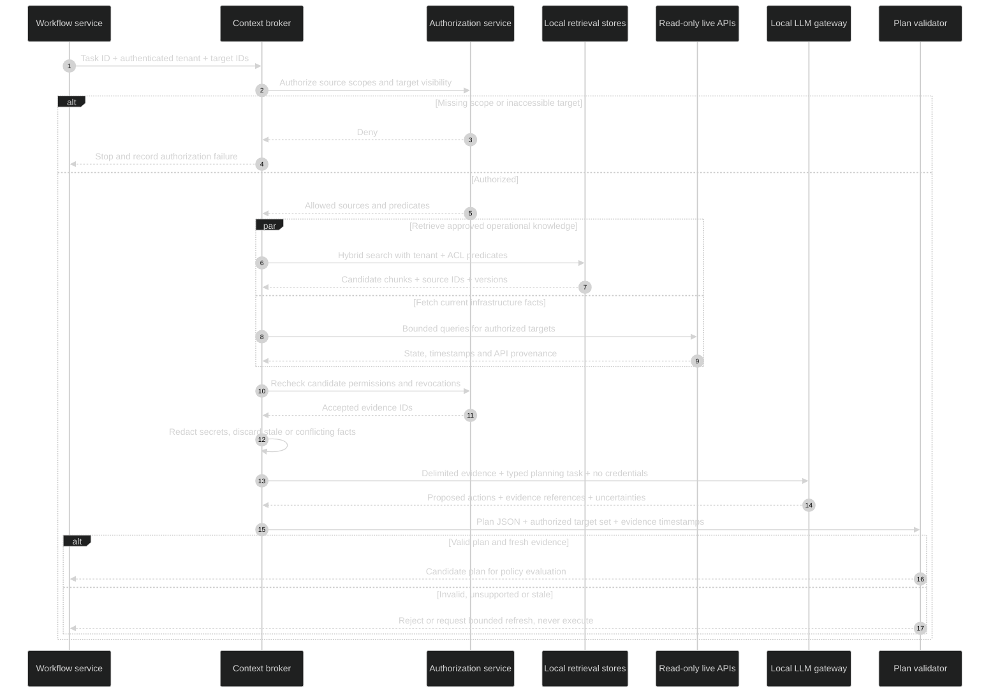
```mermaid
---
config:
  theme: dark
---
sequenceDiagram
    autonumber
    participant W as Workflow service
    participant C as Context broker
    participant A as Authorization service
    participant R as Local retrieval stores
    participant L as Read-only live APIs
    participant M as Local LLM gateway
    participant V as Plan validator
    W->>C: Task ID + authenticated tenant + target IDs
    C->>A: Authorize source scopes and target visibility
    alt Missing scope or inaccessible target
        A-->>C: Deny
        C-->>W: Stop and record authorization failure
    else Authorized
        A-->>C: Allowed sources and predicates
        par Retrieve approved operational knowledge
            C->>R: Hybrid search with tenant + ACL predicates
            R-->>C: Candidate chunks + source IDs + versions
        and Fetch current infrastructure facts
            C->>L: Bounded queries for authorized targets
            L-->>C: State, timestamps and API provenance
        end
        C->>A: Recheck candidate permissions and revocations
        A-->>C: Accepted evidence IDs
        C->>C: Redact secrets, discard stale or conflicting facts
        C->>M: Delimited evidence + typed planning task + no credentials
        M-->>C: Proposed actions + evidence references + uncertainties
        C->>V: Plan JSON + authorized target set + evidence timestamps
        alt Valid plan and fresh evidence
            V-->>W: Candidate plan for policy evaluation
        else Invalid, unsupported or stale
            V-->>W: Reject or request bounded refresh, never execute
        end
    end
```

### Engineering notes

- Tenant scope is server-derived from authenticated identity and workflow metadata, not accepted from a model-generated tenant_id field.
- Combine exact identifiers, keyword retrieval and vector search. Reranking is local and only receives candidates the caller may read.
- Preserve source versions and observation timestamps so a plan can cite its evidence. Expired permissions and stale inventory trigger revalidation.
- The plan validator checks syntax and scope, not whether the model is magically correct. Independent policy, dry-run checks and outcome verification remain separate.
- This sequence ends at a candidate plan. It does not grant execution permission; view 06 controls that transition.

### References

- [OWASP — LLM prompt injection risk](https://genai.owasp.org/llmrisk/llm01-prompt-injection/)

## 09 · Inference hardware and local serving stack

Which hardware runs the models, which hardware runs the agent, and where does model memory live?

GPU memory stores resident weights, KV cache and runtime buffers. CPU hosts run the orchestration platform; local NVMe holds model artifacts and supported staging data.

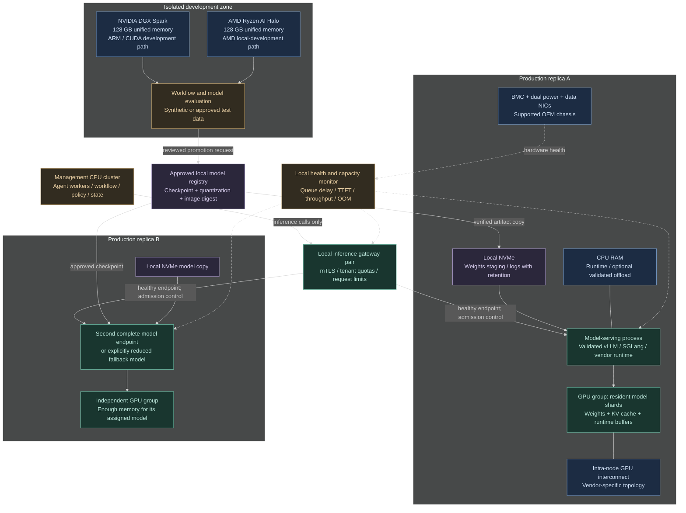
```mermaid
---
config:
  theme: dark
---
flowchart TB
    CPU["Management CPU cluster<br/>Agent workers / workflow / policy / state"]:::control
    GW["Local inference gateway pair<br/>mTLS / tenant quotas / request limits"]:::ai
    HEALTH["Local health and capacity monitor<br/>Queue delay / TTFT / throughput / OOM"]:::control
    REG["Approved local model registry<br/>Checkpoint + quantization + image digest"]:::store
    subgraph A["Production replica A"]
      APIA["Model-serving process<br/>Validated vLLM / SGLang / vendor runtime"]:::ai
      RAMA["CPU RAM<br/>Runtime / optional validated offload"]:::infrastructure
      NVMEA["Local NVMe<br/>Weights staging / logs with retention"]:::store
      GPUA["GPU group: resident model shards<br/>Weights + KV cache + runtime buffers"]:::ai
      IA["Intra-node GPU interconnect<br/>Vendor-specific topology"]:::infrastructure
      BMCA["BMC + dual power + data NICs<br/>Supported OEM chassis"]:::infrastructure
    end
    subgraph B["Production replica B"]
      APIB["Second complete model endpoint<br/>or explicitly reduced fallback model"]:::ai
      GPUB["Independent GPU group<br/>Enough memory for its assigned model"]:::ai
      NVMEB["Local NVMe model copy"]:::store
    end
    subgraph DEV["Isolated development zone"]
      SPARK["NVIDIA DGX Spark<br/>128 GB unified memory<br/>ARM / CUDA development path"]:::infrastructure
      HALO["AMD Ryzen AI Halo<br/>128 GB unified memory<br/>AMD local-development path"]:::infrastructure
      EVAL["Workflow and model evaluation<br/>Synthetic or approved test data"]:::control
    end
    CPU -->|inference calls only| GW
    GW -->|healthy endpoint; admission control| APIA & APIB
    REG -->|verified artifact copy| NVMEA
    REG -->|approved checkpoint| APIB
    NVMEA --> APIA
    RAMA --- APIA
    APIA --> GPUA
    GPUA --- IA
    NVMEB --> APIB --> GPUB
    BMCA -.->|hardware health| HEALTH
    HEALTH -.-> GW & APIA & APIB
    SPARK & HALO --> EVAL
    EVAL -->|reviewed promotion request| REG

classDef ai fill:#19362f,stroke:#63ab96,color:#bde7dc,stroke-width:1.5px;
classDef control fill:#322c20,stroke:#b39766,color:#ebd1a5,stroke-width:1.5px;
classDef infrastructure fill:#1c2c43,stroke:#6d91bd,color:#d0e0f5,stroke-width:1.3px;
classDef store fill:#2b273b,stroke:#a191c0,color:#dbd1f1,stroke-width:1.3px;
classDef human fill:#26303d,stroke:#91a1b6,color:#d1dae5,stroke-width:1.3px;
classDef stop fill:#3b252c,stroke:#c18790,color:#efc2c7,stroke-width:1.5px;
```

### Engineering notes

- The two desktop candidates both have 128 GB unified memory in the referenced specifications. That pool is shared with the system and is not 128 GB of exclusively available GPU HBM.
- Use a desktop device for local prototyping or a measured small workload. Do not assume its capacity marketing claim meets a 24/7 production latency, concurrency or redundancy requirement.
- A production AMD candidate is an OEM Instinct MI355X server: the GPU specification lists 288 GB HBM3E and 8 TB/s memory bandwidth. These are per-device specs, not guaranteed application throughput.
- For NVIDIA production, evaluate an OEM multi-GPU datacenter server against the same checkpoint, precision, power and service target. Keep a replica homogeneous; do not assume mixed CUDA/ROCm devices form one supported tensor-parallel group.
- Local NVMe is not a substitute for HBM capacity or a generic extension of KV cache. CPU/NVMe offload needs explicit runtime support and its own latency benchmark.
- Specify Linux, firmware, driver, runtime, checkpoint digest, quantization kernel support and OEM service coverage as a tested matrix. A model fitting in memory is necessary but not sufficient.

### References

- [NVIDIA DGX Spark — hardware specifications](https://docs.nvidia.com/dgx/dgx-spark/hardware.html)
- [AMD Ryzen AI Halo — official platform page](https://www.amd.com/en/products/processors/desktops/ryzen/ryzen-ai-halo.html)
- [AMD Instinct MI355X — official specifications](https://www.amd.com/en/products/accelerators/instinct/mi350/mi355x.html)
- [vLLM — parallelism and scaling](https://docs.vllm.ai/en/latest/serving/parallelism_scaling/)

## 10 · Model sharding versus service redundancy

Does buying more machines make one model fit, make it faster, or make it highly available?

Sharding divides one model across devices. A second independently complete serving group provides failover capacity. The two solve different problems.

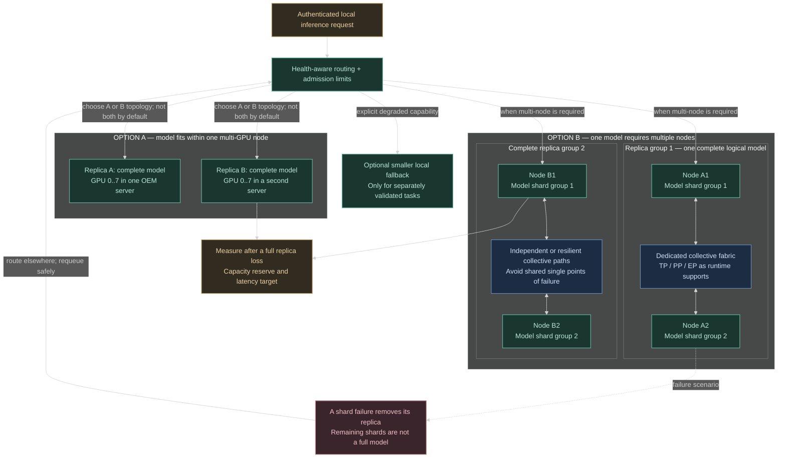
```mermaid
---
config:
  theme: dark
---
flowchart TB
    REQUEST["Authenticated local inference request"]:::control
    ROUTER["Health-aware routing + admission limits"]:::ai
    subgraph FIT["OPTION A — model fits within one multi-GPU node"]
      A["Replica A: complete model<br/>GPU 0..7 in one OEM server"]:::ai
      B["Replica B: complete model<br/>GPU 0..7 in a second server"]:::ai
    end
    subgraph LARGE["OPTION B — one model requires multiple nodes"]
      subgraph G1["Replica group 1 — one complete logical model"]
        A1["Node A1<br/>Model shard group 1"]:::ai
        A2["Node A2<br/>Model shard group 2"]:::ai
        F1["Dedicated collective fabric<br/>TP / PP / EP as runtime supports"]:::infrastructure
        A1 <--> F1 <--> A2
      end
      subgraph G2["Complete replica group 2"]
        B1["Node B1<br/>Model shard group 1"]:::ai
        B2["Node B2<br/>Model shard group 2"]:::ai
        F2["Independent or resilient collective paths<br/>Avoid shared single points of failure"]:::infrastructure
        B1 <--> F2 <--> B2
      end
    end
    SMALL["Optional smaller local fallback<br/>Only for separately validated tasks"]:::ai
    FAILURE["A shard failure removes its replica<br/>Remaining shards are not a full model"]:::stop
    SLO["Measure after a full replica loss<br/>Capacity reserve and latency target"]:::control
    REQUEST --> ROUTER
    ROUTER -->|choose A or B topology; not both by default| A & B
    ROUTER -->|when multi-node is required| A1 & B1
    ROUTER -->|explicit degraded capability| SMALL
    A2 -.->|failure scenario| FAILURE
    FAILURE -->|route elsewhere; requeue safely| ROUTER
    B & B1 --> SLO

classDef ai fill:#19362f,stroke:#63ab96,color:#bde7dc,stroke-width:1.5px;
classDef control fill:#322c20,stroke:#b39766,color:#ebd1a5,stroke-width:1.5px;
classDef infrastructure fill:#1c2c43,stroke:#6d91bd,color:#d0e0f5,stroke-width:1.3px;
classDef store fill:#2b273b,stroke:#a191c0,color:#dbd1f1,stroke-width:1.3px;
classDef human fill:#26303d,stroke:#91a1b6,color:#d1dae5,stroke-width:1.3px;
classDef stop fill:#3b252c,stroke:#c18790,color:#efc2c7,stroke-width:1.5px;
```

### Engineering notes

- TP = tensor parallelism, PP = pipeline parallelism and EP = expert parallelism. Supported combinations depend on the model architecture and serving runtime; the exact mapping is not selected by this diagram.
- Four 128 GB desktops offer 512 GB nominal aggregate memory, not one automatically usable 512 GB accelerator. Networking, runtime support, communication overhead, system reserves and shard placement still matter.
- For the historical R1-671B worked example, theoretical weight-only storage is 335.5 GB at 4 bits, 671 GB at 8 bits or 1,342 GB at 16 bits. Quantization metadata and inference memory are additional.
- Two 128 GB devices cannot hold all R1-671B weights at theoretical 4-bit storage wholly in their combined 256 GB memory. More aggressive compression or offload changes the scenario and needs validation.
- An eight-MI355X group has 2,304 GB nominal aggregate HBM by arithmetic. That is a capacity illustration, not proof of a particular checkpoint's supported kernels, usable memory, performance or failover.
- Size replica count from measured normal and failure-mode demand. A small fallback has reduced capability unless separately proven; it is not full-model HA.

### References

- [vLLM — parallelism and scaling](https://docs.vllm.ai/en/latest/serving/parallelism_scaling/)
- [DeepSeek-R1 — official repository and model table](https://github.com/deepseek-ai/DeepSeek-R1)
- [NVIDIA DGX Spark — hardware specifications](https://docs.nvidia.com/dgx/dgx-spark/hardware.html)
- [AMD Instinct MI355X — official specifications](https://www.amd.com/en/products/accelerators/instinct/mi350/mi355x.html)

## 11 · Tenant onboarding and application deployment

How does a customer request become a protected, reachable deployment?

A durable workflow allocates identity, network, compute, DNS and backup protection, verifies the service, and publishes the endpoint only after required controls pass.

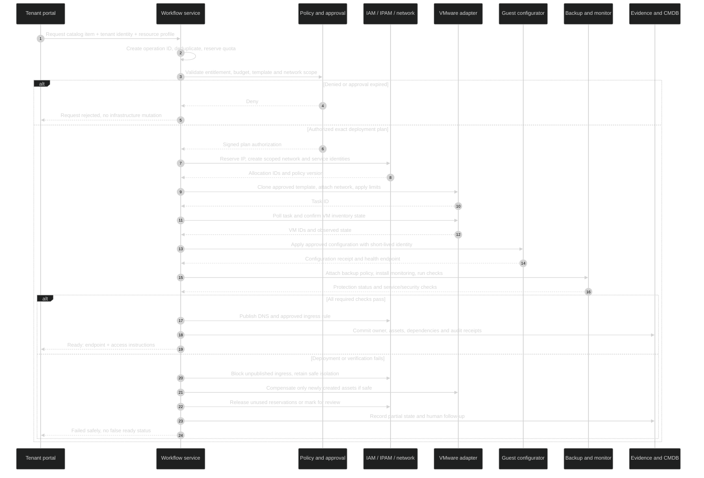
```mermaid
---
config:
  theme: dark
---
sequenceDiagram
    autonumber
    participant U as Tenant portal
    participant W as Workflow service
    participant P as Policy and approval
    participant N as IAM / IPAM / network
    participant V as VMware adapter
    participant C as Guest configurator
    participant B as Backup and monitor
    participant E as Evidence and CMDB
    U->>W: Request catalog item + tenant identity + resource profile
    W->>W: Create operation ID, deduplicate, reserve quota
    W->>P: Validate entitlement, budget, template and network scope
    alt Denied or approval expired
        P-->>W: Deny
        W-->>U: Request rejected, no infrastructure mutation
    else Authorized exact deployment plan
        P-->>W: Signed plan authorization
        W->>N: Reserve IP, create scoped network and service identities
        N-->>W: Allocation IDs and policy version
        W->>V: Clone approved template, attach network, apply limits
        V-->>W: Task ID
        W->>V: Poll task and confirm VM inventory state
        V-->>W: VM IDs and observed state
        W->>C: Apply approved configuration with short-lived identity
        C-->>W: Configuration receipt and health endpoint
        W->>B: Attach backup policy, install monitoring, run checks
        B-->>W: Protection status and service/security checks
        alt All required checks pass
            W->>N: Publish DNS and approved ingress rule
            W->>E: Commit owner, assets, dependencies and audit receipts
            W-->>U: Ready: endpoint + access instructions
        else Deployment or verification fails
            W->>N: Block unpublished ingress, retain safe isolation
            W->>V: Compensate only newly created assets if safe
            W->>N: Release unused reservations or mark for review
            W->>E: Record partial state and human follow-up
            W-->>U: Failed safely, no false ready status
        end
    end
```

### Engineering notes

- This is a catalog workflow, not arbitrary generated infrastructure code. Versioned templates and approved parameter ranges make repetition predictable.
- The transaction spans independent systems. Use a saga-style compensation record and reconcile observed state after timeouts rather than assuming an API call failed.
- Provisioning credentials are not sent to the customer or model. User access is issued through the designated identity and secrets processes.
- Publish DNS and external ingress only after the agreed readiness gates pass. Domain ownership and certificate validation are separate checked inputs.
- Attach a backup policy and verify protection readiness during onboarding. Application-specific first-backup requirements depend on the service tier and should be explicit.

### References

- [Broadcom — vSphere Automation API](https://developer.broadcom.com/xapis/vsphere-automation-api/latest/)
- [Temporal — workflow documentation](https://docs.temporal.io/workflows)

## 12 · Security incident triage and bounded containment

How does the agent respond at 03:00 without receiving unrestricted security authority?

Corroborate the alert, preserve evidence, authorize a specific containment action, then verify both containment and service impact. High-impact changes remain gated.

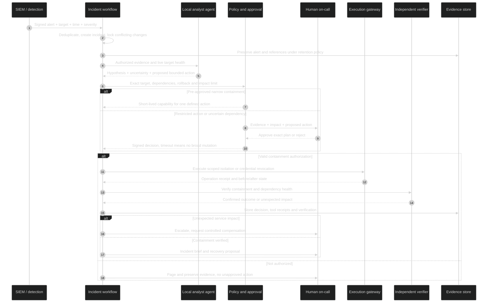
```mermaid
---
config:
  theme: dark
---
sequenceDiagram
    autonumber
    participant S as SIEM / detection
    participant W as Incident workflow
    participant A as Local analyst agent
    participant P as Policy and approval
    participant H as Human on-call
    participant X as Execution gateway
    participant V as Independent verifier
    participant E as Evidence store
    S->>W: Signed alert + target + time + severity
    W->>W: Deduplicate, create incident, lock conflicting changes
    W->>E: Preserve alert and references under retention policy
    W->>A: Authorized evidence and live target health
    A-->>W: Hypothesis + uncertainty + proposed bounded action
    W->>P: Exact target, dependencies, rollback and impact limit
    alt Pre-approved narrow containment
        P-->>W: Short-lived capability for one defined action
    else Restricted action or uncertain dependency
        P->>H: Evidence + impact + proposed action
        H-->>P: Approve exact plan or reject
        P-->>W: Signed decision, timeout means no broad mutation
    end
    alt Valid containment authorization
        W->>X: Execute scoped isolation or credential revocation
        X-->>W: Operation receipt and before/after state
        W->>V: Verify containment and dependency health
        V-->>W: Confirmed outcome or unexpected impact
        W->>E: Store decision, tool receipts and verification
        alt Unexpected service impact
            W->>H: Escalate, request controlled compensation
        else Containment verified
            W->>H: Incident brief and recovery proposal
        end
    else Not authorized
        W->>H: Page and preserve evidence, no unapproved action
    end
```

### Engineering notes

- Example pre-approved actions could be quarantining one explicitly enrolled non-critical VM or revoking one confirmed compromised workload token. The actual allowlist must reflect business impact and tested dependencies.
- Do not let one raw log entry trigger fleet-wide firewall changes. Use corroboration, target ownership and deterministic bounds; logs and tickets may contain attacker-controlled content.
- Forensic evidence capture may itself contain customer data. Restrict access and retention; do not take unlimited disk or memory copies by default.
- Containment is not automatic remediation or proof of compromise. Recovery, rejoining networks, secret rotation and customer communication may require separate approvals.
- A human timeout is not consent. Existing deterministic protections remain active, while unapproved new actions are held and escalated.

### References

- [OWASP — LLM prompt injection risk](https://genai.owasp.org/llmrisk/llm01-prompt-injection/)
- [Open Policy Agent — official documentation](https://www.openpolicyagent.org/docs)

## 13 · Patching an ESXi host without fleet-wide disruption

How is a high-risk maintenance workflow constrained and verified?

Maintenance proceeds one approved failure domain at a time. Admission checks, evacuation, post-checks and a tested recovery path are prerequisites, not optional AI suggestions.

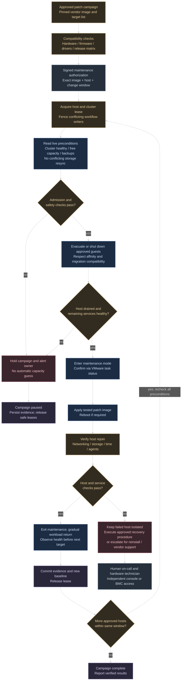
```mermaid
---
config:
  theme: dark
---
flowchart TB
    START["Approved patch campaign<br/>Pinned vendor image and target list"]:::control
    COMPAT["Compatibility checks<br/>Hardware / firmware / drivers / release matrix"]:::control
    AUTH["Signed maintenance authorization<br/>Exact image + host + change window"]:::human
    LOCK["Acquire host and cluster lease<br/>Fence conflicting workflow writers"]:::control
    PRE["Read live preconditions<br/>Cluster healthy / free capacity / backups<br/>No conflicting storage resync"]:::infrastructure
    OK{"Admission and<br/>safety checks pass?"}:::control
    HOLD["Hold campaign and alert owner<br/>No automatic capacity guess"]:::stop
    EVAC["Evacuate or shut down approved guests<br/>Respect affinity and migration compatibility"]:::infrastructure
    EMPTY{"Host drained and<br/>remaining services healthy?"}:::control
    MODE["Enter maintenance mode<br/>Confirm via VMware task status"]:::infrastructure
    PATCH["Apply tested patch image<br/>Reboot if required"]:::infrastructure
    POST["Verify host rejoin<br/>Networking / storage / time / agents"]:::control
    HEALTH{"Host and service<br/>checks pass?"}:::control
    RETURN["Exit maintenance; gradual workload return<br/>Observe health before next target"]:::infrastructure
    EVIDENCE["Commit evidence and new baseline<br/>Release lease"]:::store
    NEXT{"More approved hosts<br/>within same window?"}:::control
    DONE["Campaign complete<br/>Report verified results"]:::store
    RECOVER["Keep failed host isolated<br/>Execute approved recovery procedure<br/>or escalate for reinstall / vendor support"]:::stop
    ONCALL["Human on-call and hardware technician<br/>Independent console or BMC access"]:::human
    START --> COMPAT --> AUTH --> LOCK --> PRE --> OK
    OK -->|no| HOLD
    OK -->|yes| EVAC --> EMPTY
    EMPTY -->|no| HOLD
    EMPTY -->|yes| MODE --> PATCH --> POST --> HEALTH
    HEALTH -->|yes| RETURN --> EVIDENCE --> NEXT
    NEXT -->|yes; recheck all preconditions| LOCK
    NEXT -->|no| DONE
    HEALTH -->|no| RECOVER --> ONCALL
    HOLD --> HALTED["Campaign paused<br/>Persist evidence; release safe leases"]:::store

classDef ai fill:#19362f,stroke:#63ab96,color:#bde7dc,stroke-width:1.5px;
classDef control fill:#322c20,stroke:#b39766,color:#ebd1a5,stroke-width:1.5px;
classDef infrastructure fill:#1c2c43,stroke:#6d91bd,color:#d0e0f5,stroke-width:1.3px;
classDef store fill:#2b273b,stroke:#a191c0,color:#dbd1f1,stroke-width:1.3px;
classDef human fill:#26303d,stroke:#91a1b6,color:#d1dae5,stroke-width:1.3px;
classDef stop fill:#3b252c,stroke:#c18790,color:#efc2c7,stroke-width:1.5px;
```

### Engineering notes

- The detailed adapter must use the patching and lifecycle APIs supported by the exact VMware release. This is a workflow specification, not an unverified list of universal API calls.
- Migration depends on CPU, storage, networking, application and licensing constraints. Incompatible or pinned workloads need an approved downtime or alternate-host procedure.
- One host at a time is an initial policy example. The safe parallelism is derived from actual failure domains, workload reservations, storage state and recovery capacity.
- Firmware and hypervisor rollback are not always supported. Require a tested recovery path such as a previous supported boot image, reinstall or host replacement; do not promise a snapshot rollback.
- The agent may prepare the plan and evidence. It does not invent a patch binary, bypass a change window or decide that failed admission checks can be ignored.

### References

- [Broadcom — vSphere Automation API](https://developer.broadcom.com/xapis/vsphere-automation-api/latest/)

## 14 · Backups, restore verification and disaster recovery

How do we prove recoverability, including when the management platform is lost?

Protection, restore testing and disaster failover are separate workflows. The AI cannot delete protected recovery points or become the only way to recover itself.

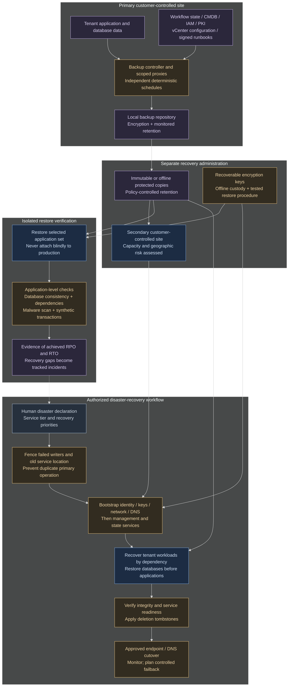
```mermaid
---
config:
  theme: dark
---
flowchart TB
    subgraph PROD["Primary customer-controlled site"]
      APP["Tenant application and database data"]:::store
      CONTROL["Workflow state / CMDB / IAM / PKI<br/>vCenter configuration / signed runbooks"]:::store
      BC["Backup controller and scoped proxies<br/>Independent deterministic schedules"]:::control
      REPO["Local backup repository<br/>Encryption + monitored retention"]:::store
    end
    subgraph VAULT["Separate recovery administration"]
      LOCKED["Immutable or offline protected copies<br/>Policy-controlled retention"]:::store
      KEYS["Recoverable encryption keys<br/>Offline custody + tested restore procedure"]:::control
      SITEB["Secondary customer-controlled site<br/>Capacity and geographic risk assessed"]:::infrastructure
    end
    subgraph TEST["Isolated restore verification"]
      RESTORE["Restore selected application set<br/>Never attach blindly to production"]:::infrastructure
      VALID["Application-level checks<br/>Database consistency + dependencies<br/>Malware scan + synthetic transactions"]:::control
      RECORD["Evidence of achieved RPO and RTO<br/>Recovery gaps become tracked incidents"]:::store
    end
    subgraph DR["Authorized disaster-recovery workflow"]
      DECLARE["Human disaster declaration<br/>Service tier and recovery priorities"]:::human
      FENCE["Fence failed writers and old service location<br/>Prevent duplicate primary operation"]:::control
      BOOT["Bootstrap identity / keys / network / DNS<br/>Then management and state services"]:::control
      REC["Recover tenant workloads by dependency<br/>Restore databases before applications"]:::infrastructure
      HEALTH["Verify integrity and service readiness<br/>Apply deletion tombstones"]:::control
      SWITCH["Approved endpoint / DNS cutover<br/>Monitor; plan controlled failback"]:::control
    end
    APP & CONTROL --> BC --> REPO --> LOCKED
    LOCKED --> SITEB
    LOCKED --> RESTORE
    KEYS --> RESTORE & BOOT
    RESTORE --> VALID --> RECORD
    DECLARE --> FENCE --> BOOT --> REC --> HEALTH --> SWITCH
    SITEB --> BOOT
    LOCKED --> REC
    RECORD -.-> DECLARE

classDef ai fill:#19362f,stroke:#63ab96,color:#bde7dc,stroke-width:1.5px;
classDef control fill:#322c20,stroke:#b39766,color:#ebd1a5,stroke-width:1.5px;
classDef infrastructure fill:#1c2c43,stroke:#6d91bd,color:#d0e0f5,stroke-width:1.3px;
classDef store fill:#2b273b,stroke:#a191c0,color:#dbd1f1,stroke-width:1.3px;
classDef human fill:#26303d,stroke:#91a1b6,color:#d1dae5,stroke-width:1.3px;
classDef stop fill:#3b252c,stroke:#c18790,color:#efc2c7,stroke-width:1.5px;
```

### Engineering notes

- RPO is acceptable data loss and RTO is acceptable restoration time. Define targets per service, then measure recovery; no target is guaranteed by this topology.
- Backups include agent and management state, but the recovery bootstrap must not require a working agent, GPU service, primary vCenter or its identity database.
- Immutable storage protects recovery points only when credentials, retention controls and physical or administrative separation are also designed correctly.
- Store deprovisioning tombstones separately and reapply them before recovered data becomes accessible. Retention and legal holds must govern backup expiry.
- Failover requires fencing the old primary or otherwise proving it cannot accept writes. DNS changes alone do not prevent split-brain databases.
- Recovery tests must validate applications, not merely that virtual disks could be copied or a VM could be powered on.

### References

- [EUR-Lex — General Data Protection Regulation](https://eur-lex.europa.eu/eli/reg/2016/679/oj/eng)

## 15 · Workflow execution lifecycle and failure semantics

What prevents retries, crashes or stale approvals from creating unintended side effects?

Every action is a durable state transition. Side effects are idempotent where possible, otherwise reconciled against authoritative operation IDs and observed state.

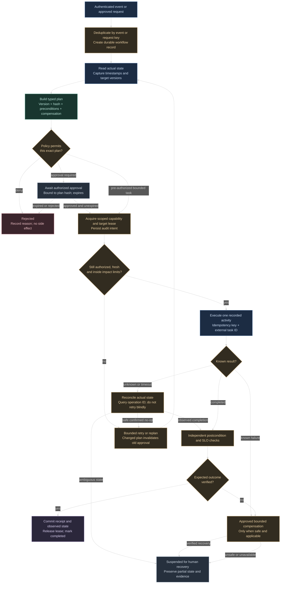
```mermaid
---
config:
  theme: dark
---
flowchart TB
    EVENT["Authenticated event or approved request"]:::infrastructure
    DEDUP["Deduplicate by event or request key<br/>Create durable workflow record"]:::control
    OBSERVE["Read actual state<br/>Capture timestamps and target versions"]:::infrastructure
    PLAN["Build typed plan<br/>Version + hash + preconditions + compensation"]:::ai
    CHECK{"Policy permits<br/>this exact plan?"}:::control
    REJECT["Rejected<br/>Record reason; no side effect"]:::stop
    WAIT["Await authorized approval<br/>Bound to plan hash; expires"]:::human
    LEASE["Acquire scoped capability and target lease<br/>Persist audit intent"]:::control
    PRE{"Still authorized, fresh<br/>and inside impact limits?"}:::control
    EXEC["Execute one recorded activity<br/>Idempotency key + external task ID"]:::infrastructure
    RESULT{"Known result?"}:::control
    RECON["Reconcile actual state<br/>Query operation ID; do not retry blindly"]:::control
    VERIFY["Independent postcondition and SLO checks"]:::control
    PASS{"Expected outcome<br/>verified?"}:::control
    COMMIT["Commit receipt and observed state<br/>Release lease; mark completed"]:::store
    COMP["Approved bounded compensation<br/>Only when safe and applicable"]:::control
    HUMAN["Suspended for human recovery<br/>Preserve partial state and evidence"]:::human
    RETRY["Bounded retry or replan<br/>Changed plan invalidates old approval"]:::control
    EVENT --> DEDUP --> OBSERVE --> PLAN --> CHECK
    CHECK -->|deny| REJECT
    CHECK -->|approval required| WAIT
    WAIT -->|approved and unexpired| LEASE
    WAIT -->|expired or rejected| REJECT
    CHECK -->|pre-authorized bounded task| LEASE
    LEASE --> PRE
    PRE -->|yes| EXEC --> RESULT
    PRE -->|no| RETRY
    RESULT -->|unknown or timeout| RECON
    RECON -->|observed completion| VERIFY
    RECON -->|safe confirmed no-op| RETRY
    RECON -->|ambiguous state| HUMAN
    RESULT -->|completed| VERIFY --> PASS
    RESULT -->|known failure| COMP
    PASS -->|yes| COMMIT
    PASS -->|no| COMP
    COMP -->|verified recovery| HUMAN
    COMP -->|unsafe or unavailable| HUMAN
    RETRY --> OBSERVE

classDef ai fill:#19362f,stroke:#63ab96,color:#bde7dc,stroke-width:1.5px;
classDef control fill:#322c20,stroke:#b39766,color:#ebd1a5,stroke-width:1.5px;
classDef infrastructure fill:#1c2c43,stroke:#6d91bd,color:#d0e0f5,stroke-width:1.3px;
classDef store fill:#2b273b,stroke:#a191c0,color:#dbd1f1,stroke-width:1.3px;
classDef human fill:#26303d,stroke:#91a1b6,color:#d1dae5,stroke-width:1.3px;
classDef stop fill:#3b252c,stroke:#c18790,color:#efc2c7,stroke-width:1.5px;
```

### Engineering notes

- The model does not own the state machine. A durable engine executes it; model calls supply candidate plans and explanations through recorded activities.
- Assume at-least-once delivery. A timeout may mean an operation succeeded but its response was lost; reconcile before repeating resource creation, deletion or power actions.
- Prevent simultaneous writers with target-scoped leases and, where supported, fencing tokens. Cross-system changes must also revalidate state before each mutation.
- Approval expires on plan changes, target changes or elapsed time. Retrying a workflow is not permission to broaden its scope.
- Compensation is not a guaranteed undo. Some security, firmware, data deletion and external side effects require human recovery or a separately authorized restore.
- The audit path must preserve approved intent before mutation and durable receipts after it. Stop subsequent side effects when durable evidence cannot be maintained.

### References

- [Temporal — workflow documentation](https://docs.temporal.io/workflows)
- [Open Policy Agent — official documentation](https://www.openpolicyagent.org/docs)

## 16 · Model, workflow and policy supply chain

How do updates enter a private environment without allowing the agent to rewrite its own guardrails?

Imports, testing, approval and deployment use separate identities. Models and runbooks are versioned artifacts; retrieved documents never become executable tools automatically.

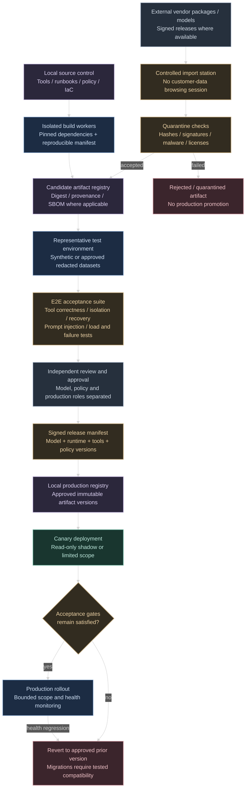
```mermaid
---
config:
  theme: dark
---
flowchart TB
    VENDOR["External vendor packages / models<br/>Signed releases where available"]:::human
    IMPORT["Controlled import station<br/>No customer-data browsing session"]:::control
    SCAN["Quarantine checks<br/>Hashes / signatures / malware / licenses"]:::control
    GIT["Local source control<br/>Tools / runbooks / policy / IaC"]:::store
    BUILD["Isolated build workers<br/>Pinned dependencies + reproducible manifest"]:::infrastructure
    ART["Candidate artifact registry<br/>Digest / provenance / SBOM where applicable"]:::store
    LAB["Representative test environment<br/>Synthetic or approved redacted datasets"]:::infrastructure
    EVAL["E2E acceptance suite<br/>Tool correctness / isolation / recovery<br/>Prompt injection / load and failure tests"]:::control
    REVIEW["Independent review and approval<br/>Model, policy and production roles separated"]:::human
    SIGN["Signed release manifest<br/>Model + runtime + tools + policy versions"]:::control
    REG["Local production registry<br/>Approved immutable artifact versions"]:::store
    CANARY["Canary deployment<br/>Read-only shadow or limited scope"]:::ai
    PROMOTE{"Acceptance gates<br/>remain satisfied?"}:::control
    PROD["Production rollout<br/>Bounded scope and health monitoring"]:::infrastructure
    ROLLBACK["Revert to approved prior version<br/>Migrations require tested compatibility"]:::stop
    REJECT["Rejected / quarantined artifact<br/>No production promotion"]:::stop
    VENDOR --> IMPORT --> SCAN
    SCAN -->|accepted| ART
    SCAN -->|failed| REJECT
    GIT --> BUILD --> ART --> LAB --> EVAL --> REVIEW --> SIGN --> REG
    REG --> CANARY --> PROMOTE
    PROMOTE -->|yes| PROD
    PROMOTE -->|no| ROLLBACK
    PROD -->|health regression| ROLLBACK

classDef ai fill:#19362f,stroke:#63ab96,color:#bde7dc,stroke-width:1.5px;
classDef control fill:#322c20,stroke:#b39766,color:#ebd1a5,stroke-width:1.5px;
classDef infrastructure fill:#1c2c43,stroke:#6d91bd,color:#d0e0f5,stroke-width:1.3px;
classDef store fill:#2b273b,stroke:#a191c0,color:#dbd1f1,stroke-width:1.3px;
classDef human fill:#26303d,stroke:#91a1b6,color:#d1dae5,stroke-width:1.3px;
classDef stop fill:#3b252c,stroke:#c18790,color:#efc2c7,stroke-width:1.5px;
```

### Engineering notes

- No external LLM fallback, remote embedding service, hosted vector store or cloud trace export is enabled in the production runtime. Approved software imports are a separate controlled path.
- Local operation must be tested under denied internet egress. Some packages, entitlement checks, model loaders or telemetry defaults may otherwise introduce external dependencies.
- Evaluation must include real tool adapters in a disposable representative environment, not only language-model benchmarks or mocked unit tests.
- Injection tests must cover malicious tickets, runbooks, filenames and tool output. Verify that policy and credentials remain inaccessible even when the model follows malicious text.
- Model updates, executable workflows, security policy and credentials require different approval roles. An agent cannot promote its own tool or permission changes.
- Never continuously fine-tune on unreviewed production interactions. Curate authorized datasets, retention and provenance before any training or evaluation reuse.

### References

- [OWASP — LLM prompt injection risk](https://genai.owasp.org/llmrisk/llm01-prompt-injection/)

## 17 · AI outages, degraded operation and break-glass

Who is in control when inference, policy, state storage or vCenter is unavailable?

Failures narrow automation rather than widen privileges. Recovery has independent credentials, network access and runbooks that do not depend on the failed system.

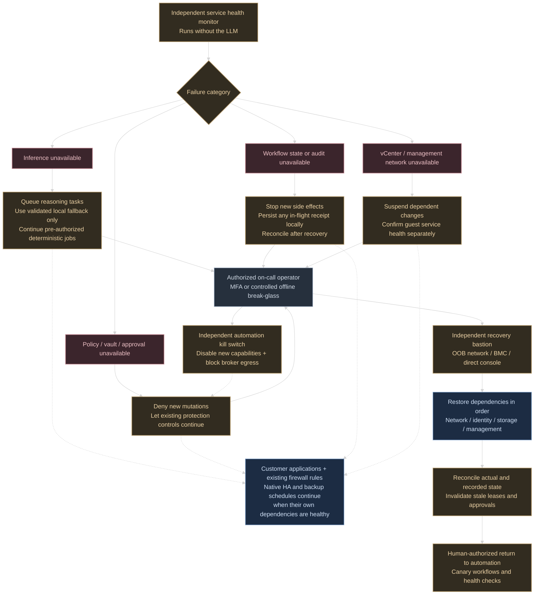
```mermaid
---
config:
  theme: dark
---
flowchart TB
    DETECT["Independent service health monitor<br/>Runs without the LLM"]:::control
    TYPE{"Failure category"}:::control
    GPU["Inference unavailable"]:::stop
    POLICY["Policy / vault / approval unavailable"]:::stop
    DB["Workflow state or audit unavailable"]:::stop
    VC["vCenter / management network unavailable"]:::stop
    GPUACT["Queue reasoning tasks<br/>Use validated local fallback only<br/>Continue pre-authorized deterministic jobs"]:::control
    POLACT["Deny new mutations<br/>Let existing protection controls continue"]:::control
    DBACT["Stop new side effects<br/>Persist any in-flight receipt locally<br/>Reconcile after recovery"]:::control
    VCACT["Suspend dependent changes<br/>Confirm guest service health separately"]:::control
    DATA["Customer applications + existing firewall rules<br/>Native HA and backup schedules continue<br/>when their own dependencies are healthy"]:::infrastructure
    HUMAN["Authorized on-call operator<br/>MFA or controlled offline break-glass"]:::human
    OOB["Independent recovery bastion<br/>OOB network / BMC / direct console"]:::control
    REC["Restore dependencies in order<br/>Network / identity / storage / management"]:::infrastructure
    RECON["Reconcile actual and recorded state<br/>Invalidate stale leases and approvals"]:::control
    RETURN["Human-authorized return to automation<br/>Canary workflows and health checks"]:::control
    KILL["Independent automation kill switch<br/>Disable new capabilities + block broker egress"]:::control
    DETECT --> TYPE
    TYPE --> GPU & POLICY & DB & VC
    GPU --> GPUACT
    POLICY --> POLACT
    DB --> DBACT
    VC --> VCACT
    GPUACT & POLACT & DBACT & VCACT --> HUMAN
    GPUACT & POLACT & DBACT & VCACT -.-> DATA
    HUMAN --> OOB --> REC --> RECON --> RETURN
    HUMAN --> KILL
    KILL -.-> POLACT

classDef ai fill:#19362f,stroke:#63ab96,color:#bde7dc,stroke-width:1.5px;
classDef control fill:#322c20,stroke:#b39766,color:#ebd1a5,stroke-width:1.5px;
classDef infrastructure fill:#1c2c43,stroke:#6d91bd,color:#d0e0f5,stroke-width:1.3px;
classDef store fill:#2b273b,stroke:#a191c0,color:#dbd1f1,stroke-width:1.3px;
classDef human fill:#26303d,stroke:#91a1b6,color:#d1dae5,stroke-width:1.3px;
classDef stop fill:#3b252c,stroke:#c18790,color:#efc2c7,stroke-width:1.5px;
```

### Engineering notes

- Fail-closed means no new unauthorized mutations; it does not mean powering off customer workloads when a policy service or model fails.
- In-flight side effects must be reconciled. Revoking a token or pressing a kill switch does not automatically undo an API operation already accepted by the target.
- Break-glass access is separately governed, logged where possible and reviewed afterward. Store recovery keys so a failed identity service cannot lock out all recovery.
- Native infrastructure HA has independent dependencies and limits. This design avoids making it dependent on AI; it does not claim that every outage leaves all workloads available.
- The management CPU cluster, state storage, local DNS/NTP, identity and recovery tooling need explicit bootstrap and recovery tests.
- A smaller fallback model may handle approved low-risk tasks only. Do not silently give it the full model's authority or claim identical performance.

### References

## 18 · Tenant offboarding, retention and verified deletion

How do we remove a customer environment without losing evidence or retaining unnoticed AI-derived copies?

Offboarding revokes access, coordinates export and retention obligations, removes approved active data and derived AI artifacts, and records a verified lifecycle outcome.

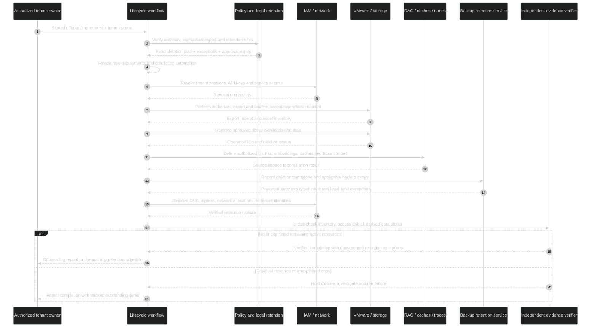
```mermaid
---
config:
  theme: dark
---
sequenceDiagram
    autonumber
    participant O as Authorized tenant owner
    participant W as Lifecycle workflow
    participant P as Policy and legal retention
    participant I as IAM / network
    participant V as VMware / storage
    participant R as RAG / caches / traces
    participant B as Backup retention service
    participant E as Independent evidence verifier
    O->>W: Signed offboarding request + tenant scope
    W->>P: Verify authority, contractual export and retention rules
    P-->>W: Exact deletion plan + exceptions + approval expiry
    W->>W: Freeze new deployments and conflicting automation
    W->>I: Revoke tenant sessions, API keys and service access
    I-->>W: Revocation receipts
    W->>V: Perform authorized export and confirm acceptance where required
    V-->>W: Export receipt and asset inventory
    W->>V: Remove approved active workloads and data
    V-->>W: Operation IDs and deletion status
    W->>R: Delete authorized chunks, embeddings, caches and trace content
    R-->>W: Source-lineage reconciliation result
    W->>B: Record deletion tombstone and applicable backup expiry
    B-->>W: Protected-copy expiry schedule and legal-hold exceptions
    W->>I: Remove DNS, ingress, network allocation and tenant identities
    I-->>W: Verified resource release
    W->>E: Cross-check inventory, access and all derived data stores
    alt No unexplained remaining active resources
        E-->>W: Verified completion with documented retention exceptions
        W-->>O: Offboarding record and remaining retention schedule
    else Residual resource or unexplained copy
        E-->>W: Hold closure, investigate and remediate
        W-->>O: Partial completion with tracked outstanding items
    end
```

### Engineering notes

- Require explicit authorization for destructive actions, legal holds and customer-data export. The AI cannot decide legal retention requirements by itself.
- An active deletion request does not override a lawful hold or immutable backup retention. Record exceptions and enforce deletion after the applicable period.
- Derived datasets include embeddings, chunk stores, prompts, summaries, caches, traces and test corpora. A VM delete is not a complete customer-data lifecycle operation.
- Replay deletion tombstones before making restored backups accessible. Verify that disabled identities cannot regain access after recovery.
- Storage disposal or secure erasure must follow the media, encryption and supplier process selected for the estate; do not equate deleting a filename with physical sanitization.

### References

- [EUR-Lex — General Data Protection Regulation](https://eur-lex.europa.eu/eli/reg/2016/679/oj/eng)

## Assumptions

### Reference, not an as-built audit

No private datacenter inventory was inspected. Device names, subnet ranges, initial counts and workflow policies are proposed. This package does not deploy or administer anything.

### Local runtime and data boundary

Inference, embeddings, retrieval stores, agent state, secrets, logs and evaluation data remain in controlled infrastructure. Software imports are quarantined and approved. No external inference fallback is proposed.

### Management independence

Run the recovery-critical workflow, identity, policy, state and monitoring services on dedicated CPU infrastructure, not exclusively on the workload cluster they must repair.

### Automation, not unbounded root access

The AI proposes typed actions. Deterministic policy, short-lived capabilities, target locks, independent verification and human approvals control side effects.

### Humans retain exceptional authority

Physical repairs, electrical safety, legal decisions, catastrophic recovery, sensitive access changes and unbounded destructive operations remain explicitly assigned to authorized people.

### No automatic GDPR conclusion

On-premises hosting can support your data-control requirement. It is neither universally mandated by GDPR nor sufficient for compliance. Obtain appropriate assessment of lawful processing, retention, roles, safeguards and transfers.

### No fixed hardware bill yet

The selected checkpoint, exact weight representation, runtime, concurrency, context length, latency target, fault tolerance, power envelope and budget are unresolved procurement inputs.

### Availability is measured, not inferred

An extra shard is not an extra replica. A second power cable is not a second utility. Quorum, storage, identity, network and recovery dependencies must be tested under real failure scenarios.

